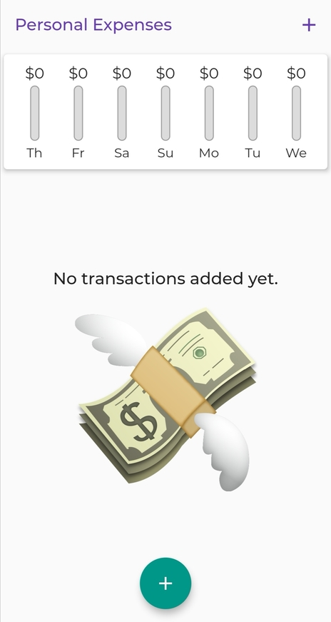
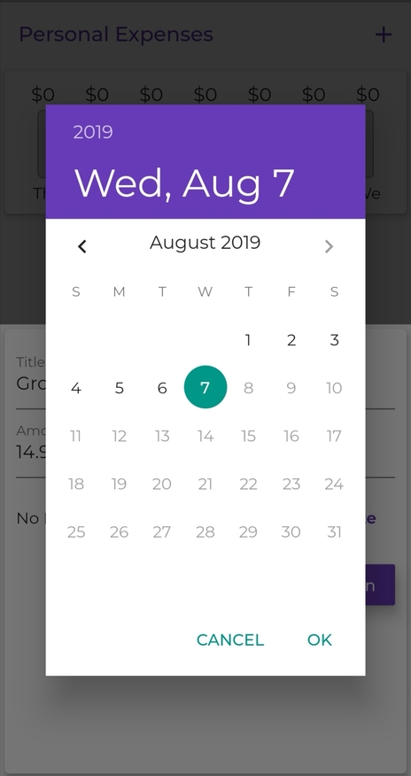
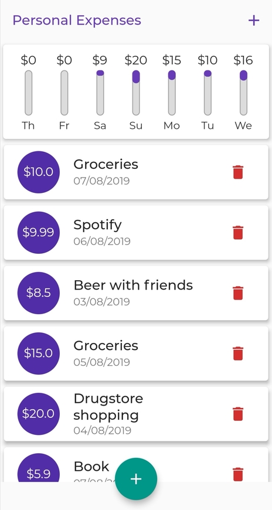
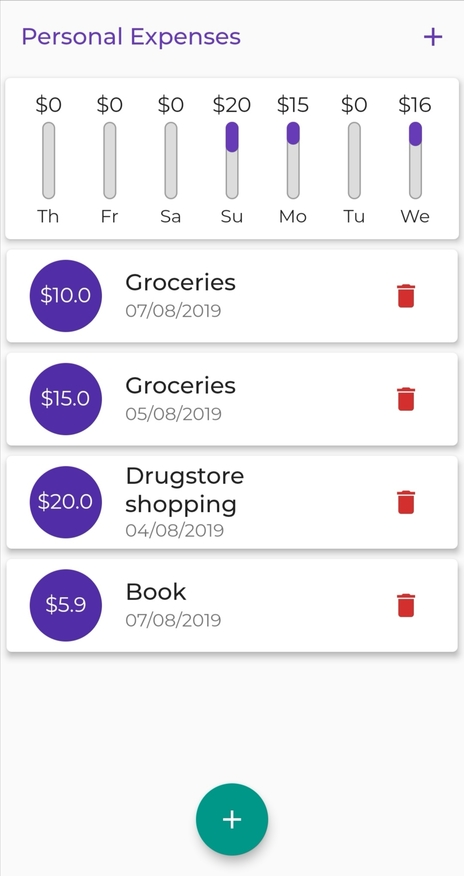

# Personal Expenses App

Flutter project made during Flutter &amp; Dart course. **Link:** https://www.udemy.com/course/learn-flutter-dart-to-build-ios-android-apps/.

## Brief Description

This project was made with the instructor during Flutter &amp; Dart Course that I take this summer. I did some changes to the original UI, such as transparent AppBar, colors, fonts, etc. 

## Issues and further development
 
 * App doesn't 'save' our spendings.
 * Chart bars look a little weird - something like upside down, need to change that for a more intuitive work.
 * Because I live in Poland, I would like to change currency to PLN, but also leave the dollar version. In conclusion, make something like a 'currency menu' where user could change his/hers country currency.
